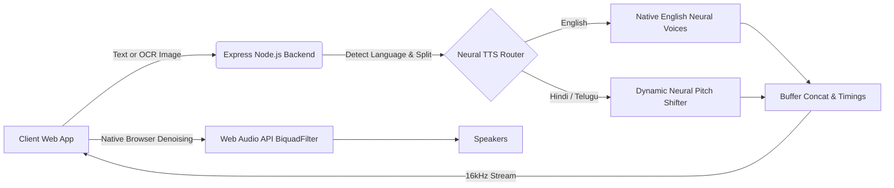

<div align="center">
  

  [](https://voiceweaver.onrender.com)
</div>

# 🎙️ VoiceWeaver

**VoiceWeaver** is a high-fidelity, multilingual text-to-speech application and audio processor featuring built-in OCR and immersive zoom inspection. Built for speed and accessibility, it features zero-latency speculative audio generation and native Web Audio API denoising to produce studio-quality outputs.

> ⚡ **Looking for the full deep learning AI engine?** Check out my main studio project: **[NeuralClone-AI](https://github.com/Shabber10/NeuralClone-AI)**.

---

## 🧬 Architecture Flow



---

## ✨ Advanced Features

- 🎧 **Web Audio API Studio Filtering**: A native in-browser `BiquadFilterNode` High-Pass filter automatically strips out low-frequency hums and mud, delivering crystal clear studio-quality playback.
- 🎛️ **Dynamic Neural Pitch Shifter**: While the Microsoft AI engine limits Indian languages to one male and one female voice, VoiceWeaver dynamically alters the SSML metadata on the fly to seamlessly simulate **5 distinct male and 5 distinct female variants** for Hindi and Telugu!
- ⚡ **Zero-Latency Playback**: Speculative background audio generation ensures playback begins the exact millisecond you hit the play button.
- 📸 **Box-less OCR Mode**: Immersive image viewing with a custom Zoom & Pan engine and real-time canvas overlays synced with OCR text.
- 💎 **Premium UI**: Stunning cyberpunk-inspired glassmorphism dashboard with smooth React-like animations built in vanilla JS.

---

## 🚀 Live Demo

Experience the power of zero-latency TTS live:
👉 **[Launch voiceweaver Demo](https://voiceweaver.onrender.com)**

---

## 🛠️ Tech Stack

- **Frontend**: Vanilla HTML5, CSS3, JavaScript (ES6+)
- **Audio Processing**: Native Web Audio API (BiquadFilterNode)
- **OCR Engine**: Tesseract.js
- **Backend**: Node.js & Express
- **TTS Engine**: Microsoft Edge Neural TTS with SSML Pitch Manipulation
- **Deployment**: Render

---

## 💻 Getting Started

1. Clone the repository:
   ```bash
   git clone https://github.com/Shabber10/voiceweaver.git
   ```
2. Install dependencies:
   ```bash
   npm install
   ```
3. Start the server:
   ```bash
   node index.js
   ```
4. Access the app at `http://localhost:3000`.

---

<div align="center">
  <i>"Bringing text to life with zero latency and high fidelity."</i>
</div>
